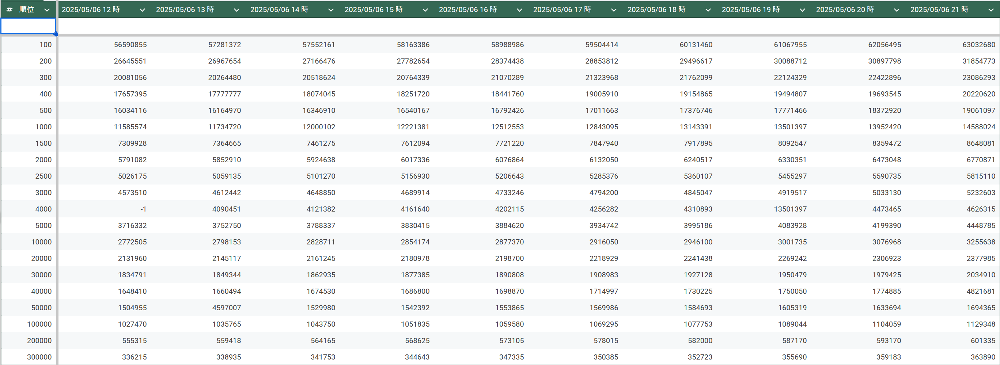

# PRSK Border Logger

**比較的まともな方法で** プロセカのイベントボーダーデータを自動的に取得します。

## DEMO
- こんな感じで毎時イベントボーダーのデータが取れます。
  - 画像は「そして針は動き出す」イベントの最終日



 
## Requirement

- MuMuPlayer (https://www.mumuplayer.com/jp/update/)
  - BlueStacks や Nox Player 等試しましたが、一番動作が安定したのが MuMuPlayer だったので
- adb (https://developer.android.com/tools/releases/platform-tools)
  - 後ほど明示的にパスを通すので、分かる場所にインストール
- spread sheet へのアクセス権とアカウントキーの発行
  - [こちら](https://developers.google.com/workspace/sheets/api/quickstart/python) を参考にアカウントの作成と credential.json をダウンロードして任意パスに配置
- mamba
  - 必須ではありませんが便利なので。使用バージョンは以下
```
$ mamba --version
mamba 1.5.12
conda 24.11.3
```
 
## Installation

### 依存関係
```bash
$ git clone https://github.com/2clchino/prsk_logger.git
$ cd prsk_logger
$ mamba env create --file env.yaml -n prsk_logger
$ mamba activate prsk_logger
```

### 環境変数設定
- `$ mv .env.example .env` して、プロジェクトルートに .env ファイルを作成し以下を設定
```
ADB_PATH=/mnt/d/platform-tools/adb.exe      // Requirement でダウンロードしてきた adb のパス
CAPTURE_CMD=/mnt/c/Windows/System32/cmd.exe // cmd のパス (Windows 上で実行する場合は cmd.exe のみでよい)
SHORTCUT_PATH=D:\\prsk.lnk                  // MuMuPlayer のショートカットパス

CREDENTIALS_FILE=                           // Requirement でダウンロードした credential.json のパス
SPREADSHEET_KEY=                            // 書き込みしたい spread sheet の ID

// 以下プロジェクトルートからの相対パスで見られます (絶対パスで書けば絶対パスで読まれます)
TEMP_DATA_FILE=data.json                    // 一時データのローカル保存先
UI_PARTS_FOLDER=ui_parts
BANNERS_FOLDER=banners
CONFIG_FILE=event_config.yaml
LAUNCH_FLAG=launch_flag
```

## Usage
- `launch_app.py` を実行すると、MuMuPlayer を起動してプロセカのイベントページまで移動
- `main.py` を実行すると、ランキングをログに保存し、google spread sheet にデータをアップロード
```bash
$ python src/launch_app.py
$ python src/main.py
```

- crontab に `cron_sample.txt` の中身をコピーすることで毎時自動で記録してくれるようになります
 
## Issue
- 1 と 4, 5 と 8 の認識精度どうにかする
- スプシもっと見やすくする
- ~~実行時にイベントパラメータをファイルから読んで、実行可否を判定するようにする~~
- ~~launch_app() -> main_prcs() の引継ぎ (前でコケたら止める)~~
 
## Author
 
Cl2CHINO
